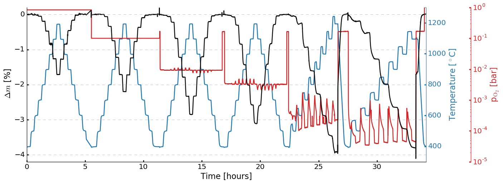
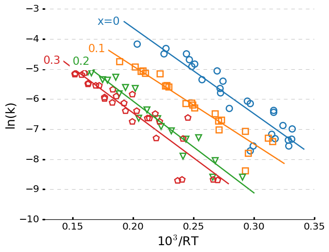
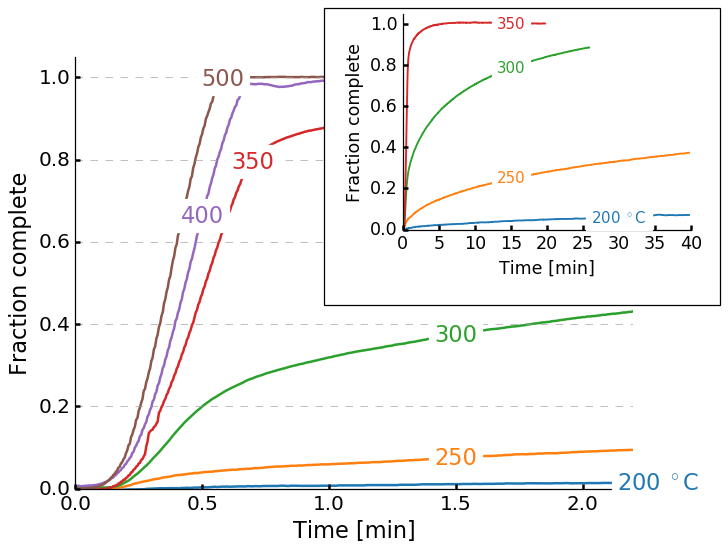
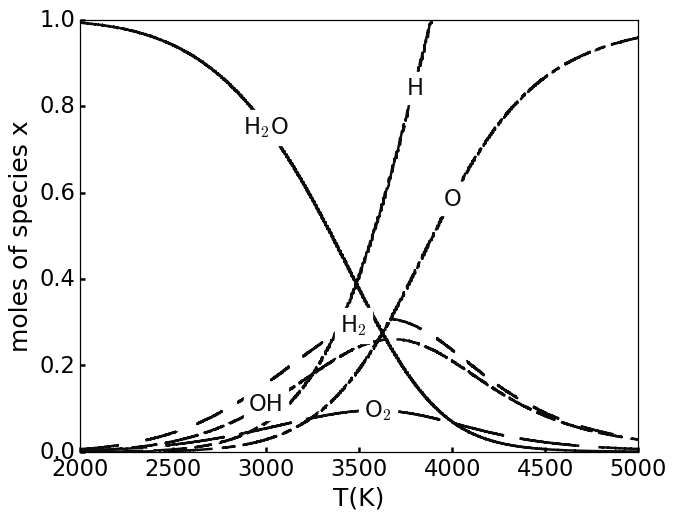
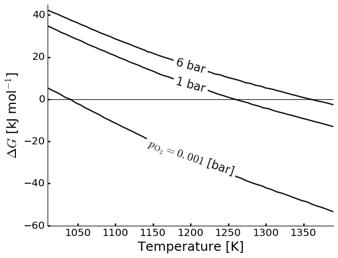
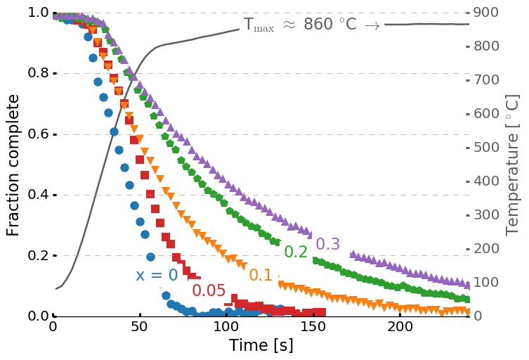
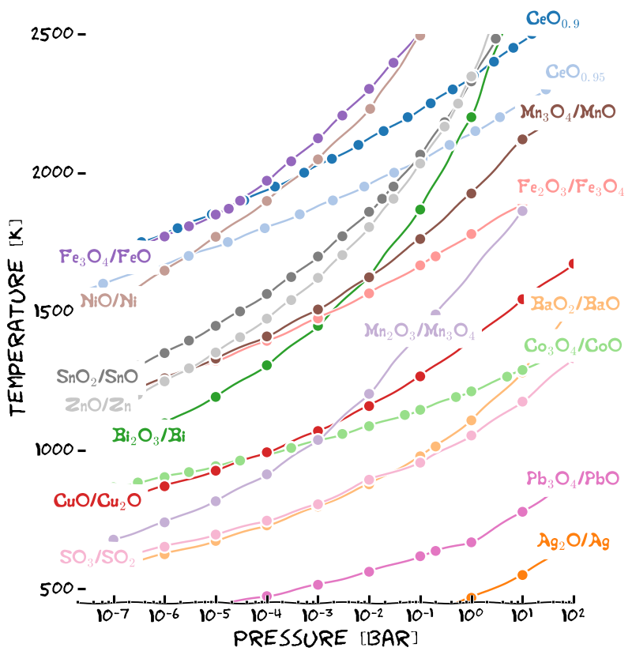

pubplots package
================

Submodules
----------
pubplots PlotData class
------------------------

.. autoclass:: pubplots.plotdata.PlotData
    :members:

pubplots.plot module
--------------------

.. automodule:: pubplots.plot
    :members:
    :undoc-members:
    :show-inheritance:

pubplots.colorsmarkers module
-----------------------------

.. automodule:: pubplots.colorsmarkers
    :members:
    :undoc-members:
    :show-inheritance:

Examples
========
1 three y axis
--------------
.. literalinclude:: examples/1_threeyaxis.py

2 linear fits
---------
.. literalinclude:: examples/2_fitscatter.py

3 Inset
--------------------------------
.. literalinclude:: examples/3_inset.py

4 old hat style
-------
.. literalinclude:: examples/4_oldhat.py

5 Rotated labels
--------------
.. literalinclude:: examples/5_rotatedlabels.py

6 Markers
---------------
.. literalinclude:: examples/7_scatterleft.py

7 With xkcd
----------------
.. literalinclude:: examples/8_xkcd.py

